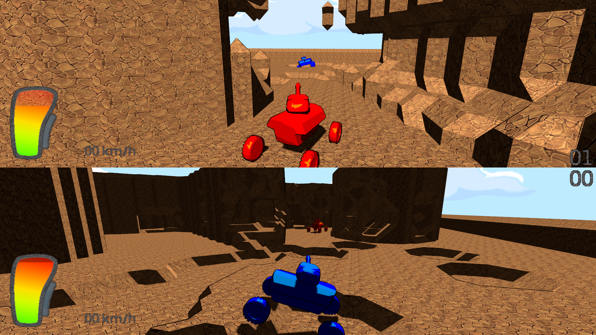

Tank Wars
==============

Game Programming WS15/16

Timothy Blut | 334609 | <timothy.blut@rwth-aachen.de>

Daniel Neyburg | 333697 | <daniel.neyburg@rwth-aachen.de>

Building
---------------

To build execute `cmake DCMAKE_BUILD_TYPE=RELEASE .` and then `make` in the root directory of the project. To start the game run `./tankwars`.

The game expects the "Content" folder to be in the same directory as the game executable.

So if the game is built in a different directory then the "Content" folder has to be copied to that location.

Playing
---------------

The game only works with game controllers, so it doesn't react to keyboard and mouse input.

Also every controller is handeled differently by GLFW3 so some actions might not get detected by the game.

The actions for digital buttons are

* Shooting
* Driving
* Reverse
* Stopping
* Reseting the tank
* Increasing/Deacreasing the shooting power
* Toggling zoom for aiming
* Adjusting the camera distance

The actions for analog axes are:

* Steering
* Turning the turret
* Adjusting the cannon

Sadly there is no way to configure the actions for different controllers. So the correct buttons and axes have to be found through trial and error.

The first player (top screen) was configured for the XBox 360 Controller and the second player for a generic controller with a Playstation layout.

The thumb sticks steer the tank and turn/adjust the turret, the shoulder buttons make the tank drive and with the DPad the camera can be zoomed in and out. The other actions are different on many controllers.